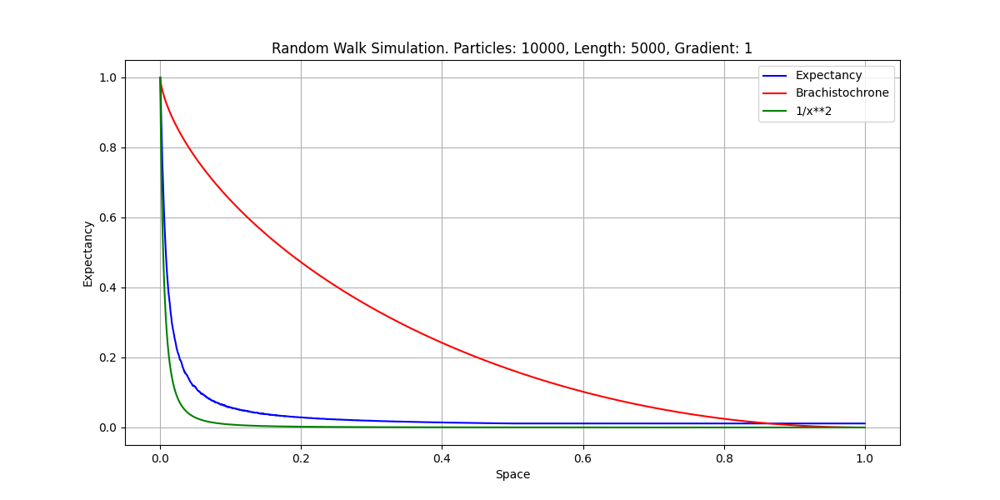

# gsettings_ui
 

[]

## Overview
**Markov** is a Python based simulation of Markovian process for a random walk in time dilation field
with linear time dilation gradient. The gradient is simulated with a scalar field that adjusts Markov process
probabilities as function of distance. In such field probabilities of going up (against the direction of dilation gradient) or 
down (in the direction of dilation gradieant ) are function of distance from 'center' of the field. Center is the point of
maximal time dilation.

## Setup
To run simulation with different parameters, you can adjust them in the beginning of the code.
# LENGTH - max distance from the center
# GRADIENT - field 'strength' or gradient rate
# ITERATIONS - Number of iterations. Each iteration represents one particle.

## Screenshot 1: Schema viewer

